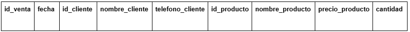

## (2H) NORMALIZACIÓN Y CONSULTAS EN MYSQL

INSTRUCCIONES GENERALES

1. Lea cuidadosamente todo el enunciado antes de comenzar.

2. Justifique cada paso del proceso de normalización de forma clara.

3. El script SQL debe ejecutarse sin errores de sintaxis.

4. Las consultas deben utilizar correctamente la cláusula JOIN.

5. rohibido: El uso de apuntes o internet (según criterio del Trainer).

## PARTE I – ANÁLISIS DE LA TABLA INICIAL (20 puntos)

Una empresa registra sus ventas en una única tabla con la siguiente estructura:

Tabla: ventas_sin_normalizar

# Consideraciones del negocio:

- Un cliente puede realizar muchas ventas.

- Una venta puede incluir varios productos.

- El precio depende únicamente del producto.

- El nombre y teléfono dependen únicamente del cliente.

- La fecha depende únicamente de la venta.

# Tareas a realizar:

1. Indique cuál sería la Clave Primaria compuesta de esta tabla.

- La llave primaria compuesta de la table: id_cliente

2. Liste las Dependencias Funcionales presentes.

-  id_cliente, id_producto, id_venta, 

3. Explique por qué la tabla cumple con la 1FN.

- La tabla cumple con la normalizacion 1 por que muestra todos lo que necesitamos en la normalizacion para poder seguir con las otras formas de normalizacion 

4. Explique por qué la tabla NO cumple con la 2FN.

- No cumple con la 2 forma de normalizacion por que no esta organizado todas las tablas , esta todo en solo 1 tabla lo cual no se puede porque salen muchas tablas cuando se normaliza

5. Identifique las Dependencias Transitivas encontradas.

-  

## PARTE II – NORMALIZACIÓN (30 puntos)

### Normalice la estructura anterior hasta Tercera Forma Normal (3FN). El desarrollo debe incluir:

1. Paso a 2FN: Indique qué tablas se generan, qué columnas contienen y la justificación técnica.

- Las tables total que se generaron en la normalizacion , seria
tabla clientes, la tabla clientes contiene 3 columnas , las cuales son 
id_cliente que es la llave primaria osea la PRIMARY KEY, con tiene el 
nombre_cliente con su respectivo campo obligatorio (NOT NULL), y contiene
telefono con su campo obligatorio (NOT NULL).

- tabla productos, la tabla productos contiene 3 columnas , las cuales son
id_producto , que es la llave primaria , PRIMARY KEY , trae 
nombre_producto, y trae precio_productos son su not null , y con su campo 
de letras y de numeros 

- tabla ventas, la tabla ventas con tiene 2 columnas y una llave foranea las
columnas es id_venta es que es la PRIMARY KEY , columna de fecha con su
campo solo para fecha, el id_cliente que es la llave foranea osea 
la FOREIGN KEY , que viene de la tabla clientes y trae a su llave primaria

- tabla detalle_venta , que trae 2 columnas que son de llaves foraneas y 1 columba que si es de ella que es la cantidad ,  las foreing key vienen de las tablas , ventas y productos 

2. Paso a 3FN: Identifique qué dependencias transitivas se eliminan para llegar a este estado.

3. Esquema Final: Liste las tablas finales especificando claramente:

- PK (Primary Key)
- FK (Foreign Key)
- Relaciones (1:N, N:M)

## PARTE III – SCRIPT EN MYSQL (25 puntos)

### Escriba el script SQL completo. Asegúrese de incluir:

- Creación y uso de la base de datos: CREATE DATABASE examen_ventas;

- Creación de tablas siguiendo el modelo 3FN.

- Definición de Primary Keys y Foreign Keys.

- Tipos de datos adecuados (Ej: INT, VARCHAR, DECIMAL, DATE).

## PARTE IV – CONSULTAS CON JOIN (25 puntos)

### Escriba las sentencias SQL para resolver los siguientes requerimientos:

1. Ventas Generales: Mostrar id_venta, fecha y nombre_cliente.

2. Detalle de Venta: Mostrar id_venta, nombre_cliente, nombre_producto, cantidad, precio_producto y el Subtotal (cantidad × precio).

3. Reporte de Gastos: Mostrar nombre_cliente y el Total Gastado (suma de todos sus subtotales). Ordenar de mayor a menor gasto.

# Resultado esperado

## FORMATO DE ENTREGA

### El estudiante deberá subir a la github en un repositorio privado:

1. Documento de texto: (PDF o Word) con el desarrollo de la normalización.

2. Archivo SQL: .sql con el código fuente.

3. Evidencia: Capturas de pantalla de los resultados de las consultas.

